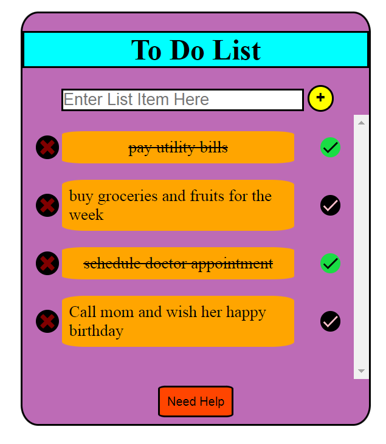
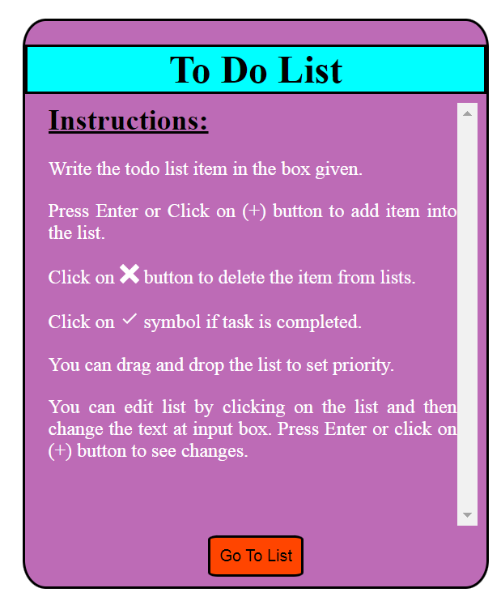

# Todo List App

## Description

Todo List App is a simple task management application that helps users create and keep track of their tasks. The app includes the following features:

1. **Add New Task**: Users can add a new task to the list by entering the task description in the input box and clicking the "Add" button.

2. **Mark Task as Completed**: Tasks can be marked as completed or uncompleted using a toggle button. When a task is completed, it is visually indicated with an overline.

3. **Edit Task**: Users can edit the task description to make any changes or updates.

4. **Prioritize by Drag and Drop**: Tasks can be prioritized by dragging and dropping them to reorder the list based on their importance.

5. **Delete Task**: Users can easily delete a task by clicking the cross button associated with each task.

6. **Help Section**: A help button is available to provide assistance and guide users on how to use the app.

## Installation

To run the Todo List App locally, follow these steps:

1. Clone this repository or download the project files from GitHub.

2. Open your terminal and navigate to the project directory.

3. Install the required node modules using the following command:

   ```bash
   npm install
   ```

4. Start the development server with the following command:

   ```bash
   npm start
   ```

5. The app should now be running on your local server. Open your web browser and access it at `http://localhost:3000`.

## Usage

1. Enter the task description in the input box.

2. Click the "Add" button to add the task to the list.

3. Use the toggle button to mark a task as completed or uncompleted.

4. Drag and drop tasks to prioritize them based on importance.

5. To delete a task, click the cross button associated with that task.

6. If you need any assistance, click the "Help" button to access the help section.

## Demo

Check out the [Demo Video](https://github.com/juhikumarimodi6/React-todo-list/blob/main/Todo-list-video.webm) to see the Todo List App in action.

## Technologies Used

- React.js v18.2
- CSS
- React Hooks (useState())
- Library: [react-icons](https://react-icons.github.io/react-icons/), [react](https://react.dev/learn)

## Screenshots

  

## Contributing

Thank you for considering contributing to the Todo List App! If you find any bugs, have feature requests, or want to submit pull requests, please follow these guidelines:

- Before reporting a bug, check the existing issues to see if it has been reported already.

- When submitting a bug report or feature request, provide detailed information and steps to reproduce the issue.

- For pull requests, explain the changes you made and ensure that the app's functionality and existing tests remain intact.

## Contact Information

Feel free to reach out to me by email at juhikumarimodi6@gmail.com if you have any questions, suggestions, or feedback.

---

   
